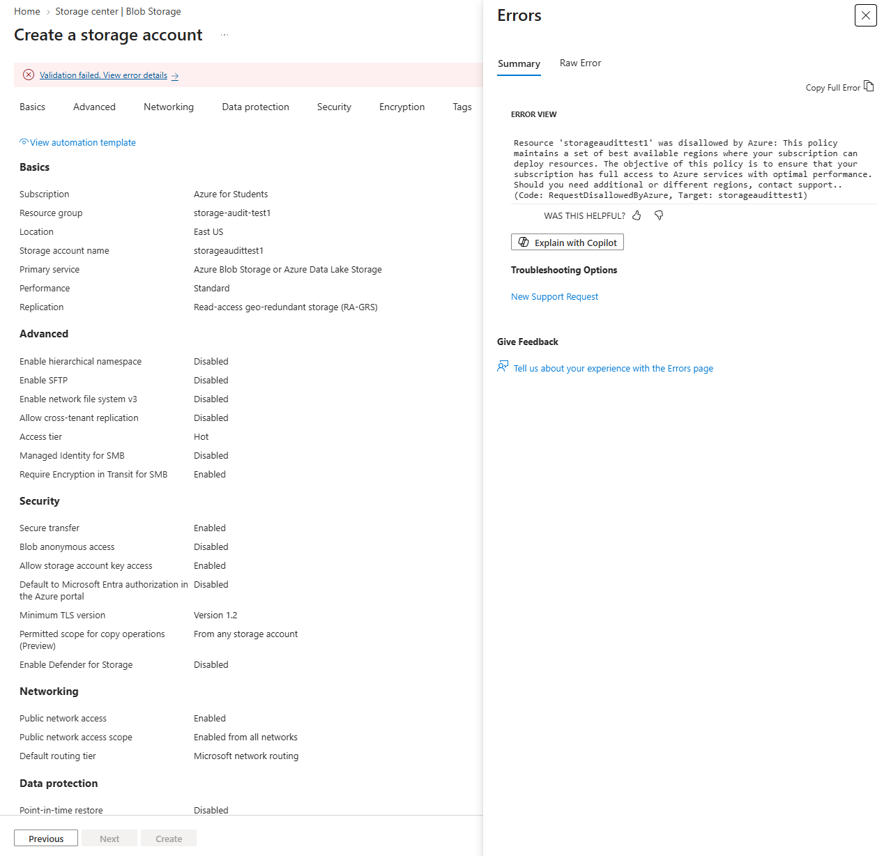

# 🏛️ Fase 1: Gobierno y Cumplimiento (Azure Policy)

**Objetivo:** Establecer barreras de protección (guardrails) preventivas a nivel de suscripción para garantizar el cumplimiento normativo (GDPR) y evitar el despliegue de infraestructura no autorizada (Shadow IT).

## 1. Implementación de Soberanía de Datos
Para garantizar que los datos de la compañía no abandonen la jurisdicción legal europea, se ha desplegado la directiva `Allowed locations` en el ámbito raíz de la suscripción.

* **Efecto de la directiva:** `Deny` (Bloqueo preventivo).
* **Parámetro configurado:** Región restringida exclusivamente a `westeurope` (Europa Occidental).

## 2. Validación y Pruebas de Bloqueo
Se ha ejecutado una prueba de intrusión administrativa intentando aprovisionar infraestructura en una región no autorizada (`East US`). Como demuestra la siguiente evidencia, el motor de Azure Resource Manager (ARM) intercepta la petición y deniega la acción antes de que se inicie el aprovisionamiento, demostrando una postura de seguridad "Shift-Left".

>  

---
*Fase 1 completada. La infraestructura base ahora está securizada geográficamente.*