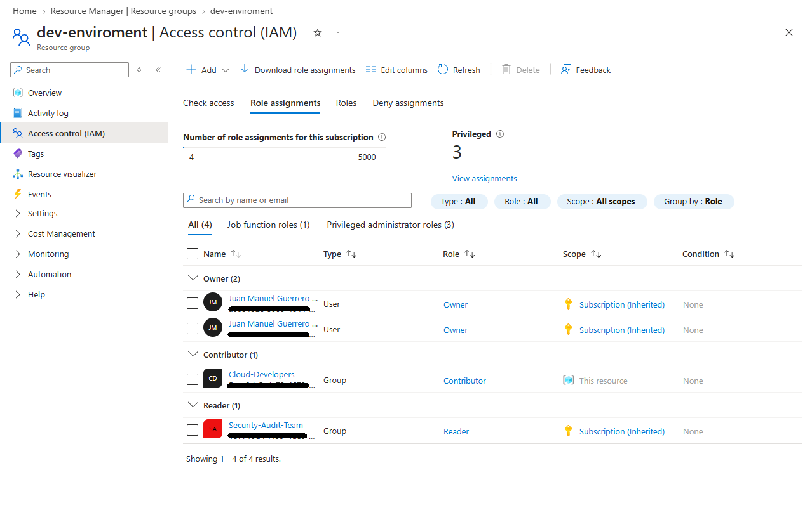

# 🔐 Fase 2: Arquitectura de Control de Acceso (RBAC)

**Objetivo:** Implementar un modelo de control de accesos basado en roles (RBAC) aplicando el Principio de Privilegio Mínimo (PoLP) y la segregación de funciones para prevenir el movimiento lateral en caso de credenciales comprometidas.

## 1. Segregación de Funciones (SoD)
Se han estructurado dos grupos de seguridad principales en Microsoft Entra ID con requerimientos operativos opuestos:

* **Security-Audit-Team:** Requiere visibilidad global para auditorías de cumplimiento, pero sin capacidad destructiva.
* **Cloud-Developers:** Requiere capacidad de despliegue y modificación de infraestructura, pero limitada a entornos de desarrollo específicos para reducir el *blast radius* (radio de impacto).

## 2. Asignación de Permisos y Ámbitos (Scopes)
Para aislar los entornos, se ha aplicado la siguiente matriz de permisos, asegurando que los desarrolladores no hereden permisos a nivel de suscripción.

| Grupo de Seguridad | Rol Asignado (Azure RBAC) | Ámbito (Scope) de Asignación |
| :--- | :--- | :--- |
| `Security-Audit-Team` | Reader (Lector) | Suscripción (Raíz) |
| `Cloud-Developers` | Contributor (Colaborador) | Grupo de Recursos (`rg-dev-environment`) |

>  

---
*Fase 2 completada. El acceso a la infraestructura base está ahora compartimentado.*