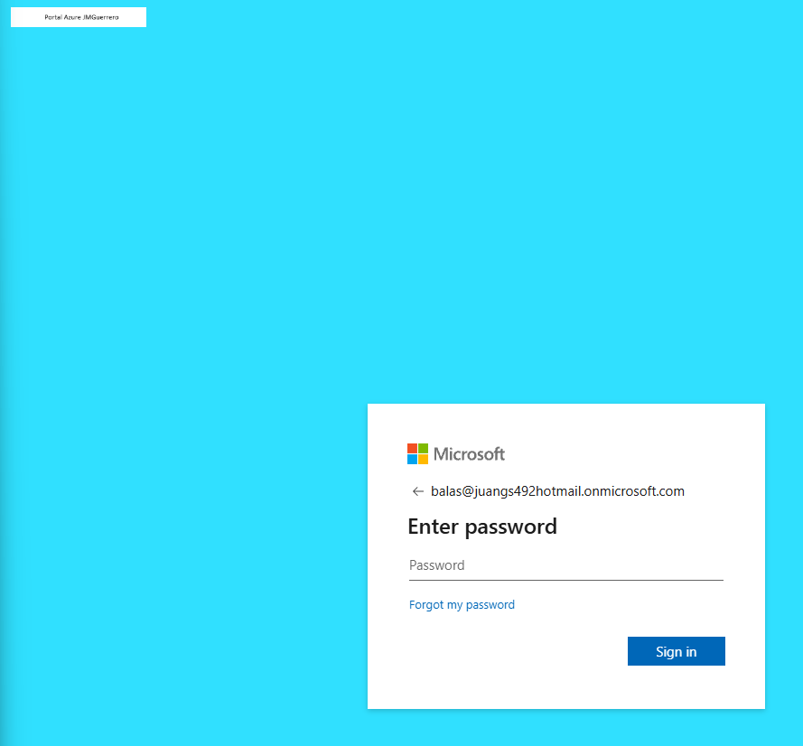
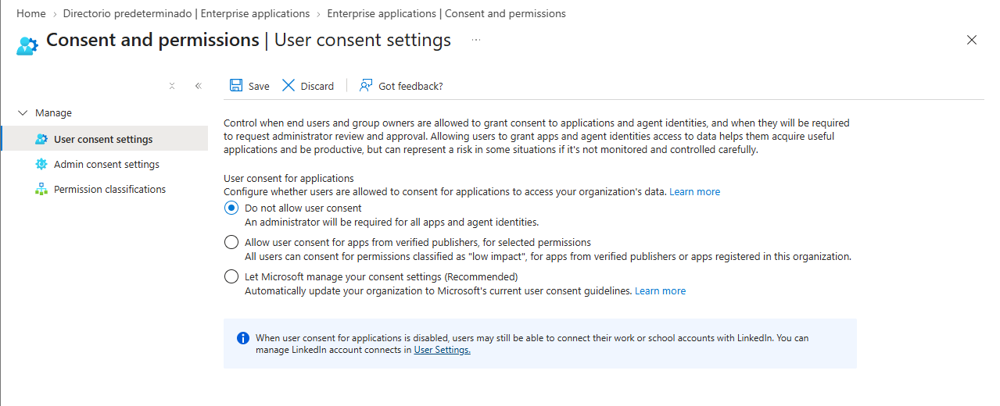

# 🛡️ Fase 3: Resiliencia de Identidad y Anti-Phishing

**Objetivo:** Reducir la superficie de ataque frente a campañas de ingeniería social corporativa y bloquear vectores de ataque modernos (como el *OAuth Phishing*), garantizando que los usuarios interactúen únicamente con portales y aplicaciones verificadas.

## 1. Barrera Visual de Confianza (Company Branding)
Para mitigar el riesgo de suplantación de identidad en los portales de acceso, se ha implementado la personalización visual del inquilino (Tenant). Esta medida preventiva permite a los usuarios verificar la legitimidad del punto de inicio de sesión corporativo antes de introducir sus credenciales.

>  

## 2. Prevención de Consentimiento Ilícito (OAuth Phishing)
Los atacantes frecuentemente utilizan aplicaciones maliciosas de terceros para engañar a los usuarios y obtener acceso a los datos corporativos sin necesidad de robar contraseñas. Para neutralizar este vector, se ha deshabilitado el consentimiento del usuario final para aplicaciones empresariales.

**Regla implementada:** Cualquier integración de software de terceros requiere un proceso de revisión y aprobación explícita por parte del equipo de seguridad (*Admin consent workflow*).

>  

---
*Fase 3 completada. La identidad está protegida tanto a nivel visual como en la capa de permisos de aplicaciones.*