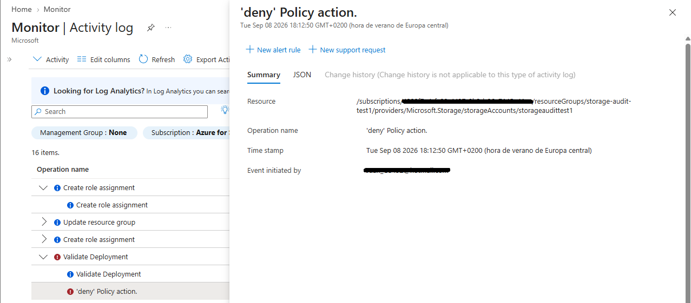

# 🔎 Fase 4: Trazabilidad Forense y Auditoría

**Objetivo:** Garantizar la visibilidad integral de las operaciones administrativas y de seguridad dentro de la suscripción, centralizando los registros para facilitar la respuesta a incidentes (IR) y la integración con herramientas SIEM.

## 1. Monitorización de Eventos de Seguridad
El **Azure Activity Log** actúa como la fuente principal de la verdad para todas las operaciones de plano de control (Control Plane). Se ha verificado la correcta ingesta y trazabilidad de los siguientes eventos críticos de seguridad:

*   **Aplicación de Políticas (Deny):** Registro exacto de los intentos de despliegue bloqueados por la directiva de soberanía de datos (Fase 1).
*   **Modificaciones de IAM (RBAC):** Trazabilidad completa sobre quién, cuándo y dónde se han asignado nuevos privilegios a los grupos de seguridad (Fase 2).

>  

## 2. Preparación para Operaciones de Seguridad (SecOps)
Tener estos registros centralizados y estructurados en formato JSON permite que el entorno esté preparado para exportar estas señales de forma continua a un área de trabajo de Log Analytics o directamente a Microsoft Sentinel, habilitando la detección y respuesta automatizada de amenazas.

---
*Fase 4 completada. La infraestructura base cuenta ahora con trazabilidad operativa y forense.*