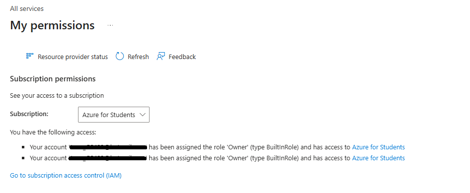
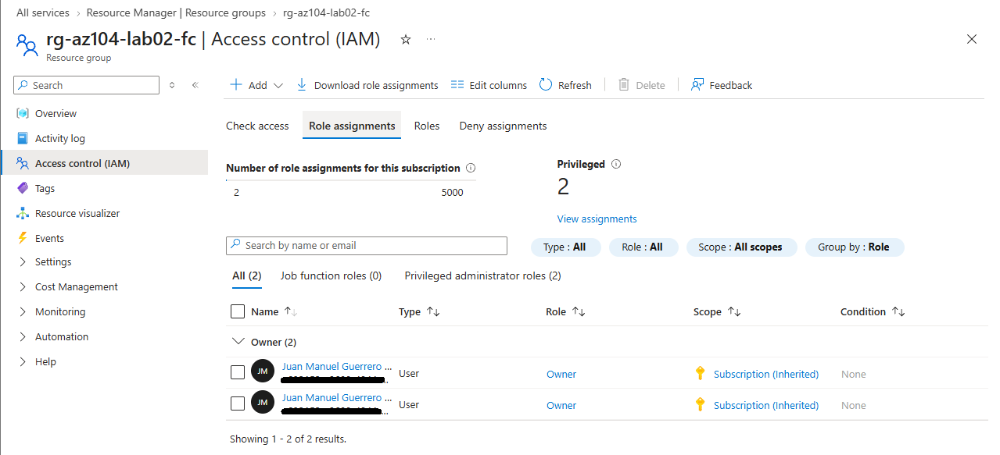
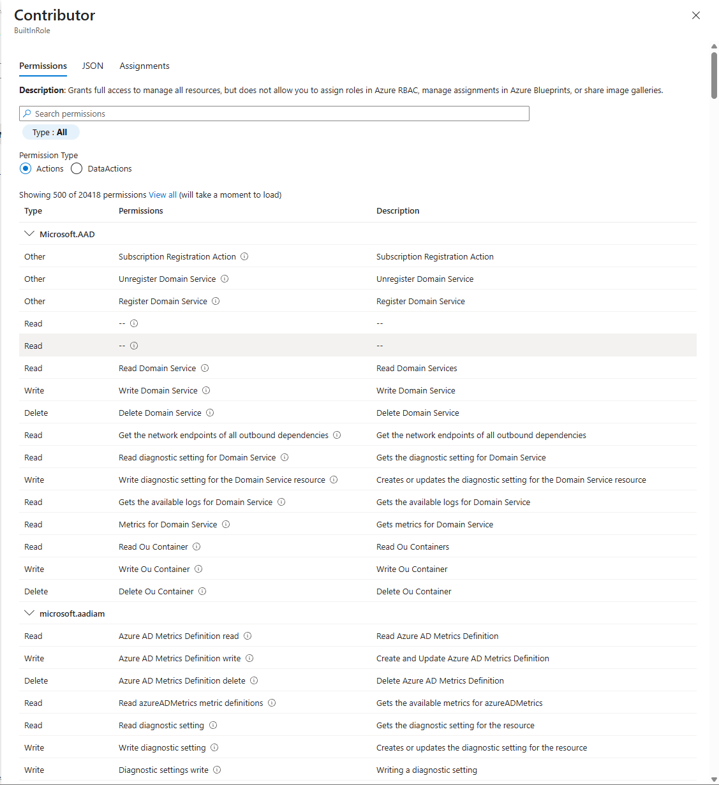

# 🛡️ Runbook de Auditoría de Seguridad: Azure RBAC (IAM)

**Objetivo:** Establecer un procedimiento operativo estándar (SOP) para auditar permisos de usuarios y verificar el principio de mínimo privilegio en infraestructuras de Microsoft Azure utilizando el Control de Acceso Basado en Roles (RBAC).

## 1. Auditoría de Privilegios Propios (Self-Audit)
El primer paso en cualquier revisión de seguridad es verificar los permisos efectivos de la cuenta auditora/administradora en el tenant actual.

* **Ruta de acceso:** `Azure Portal > Perfil > Mis permisos`
* **Validación:** Se verifica el nivel de acceso directo de la cuenta frente a la suscripción para evitar elevaciones de privilegios no documentadas.

> 🖼️ 

## 2. Análisis de Asignaciones a Nivel de Recurso (Scope Analysis)
La evaluación de la herencia de permisos es crítica. Un usuario puede tener acceso a un recurso crítico no por una asignación directa, sino por una herencia desde el Grupo de Administración o Suscripción.

* **Ruta de acceso:** `Grupo de Recursos > Control de Acceso (IAM) > Asignaciones de roles`
* **Puntos de control:**
  * Identificar cuentas huérfanas o no autorizadas.
  * Diferenciar en la columna **Ámbito (Scope)** si el acceso es `(Heredado)` o asignado directamente a `Este recurso`.

> 🖼️ 

## 3. Revisión de Definición de Roles (Actions vs NotActions)
Azure RBAC opera bajo un modelo de concesión donde los permisos efectivos se calculan restando las operaciones denegadas (`NotActions`) de las permitidas (`Actions`).

* **Ruta de acceso:** `IAM > Roles > [Seleccionar Rol]`
* **Caso de estudio (Rol Colaborador):** Se audita la definición JSON del rol para verificar que, aunque posee comodines `*` en *Actions* (control total del plano de control), tiene restricciones explícitas en *NotActions* que impiden la modificación de asignaciones de roles, aislando así la capacidad de escalar privilegios.

> 🖼️ 

---
*Documento generado como parte de los procedimientos de seguridad y gobierno de infraestructura Cloud.*