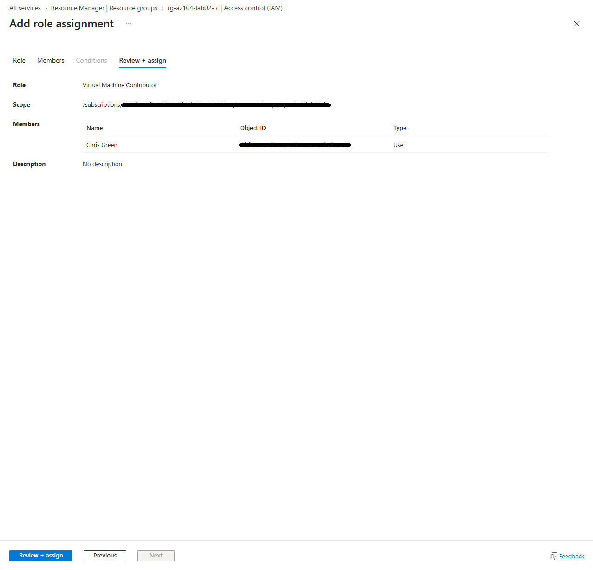
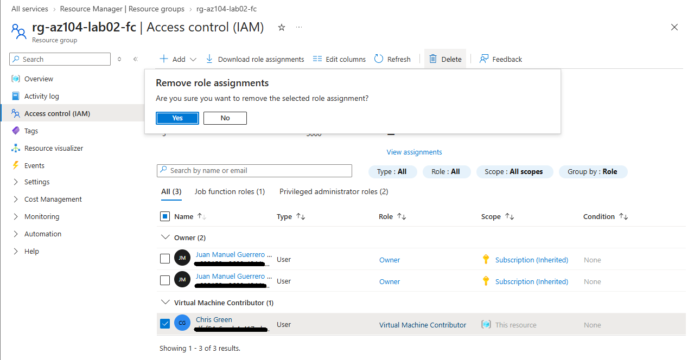

# 🚀 Runbook de Aprovisionamiento y Revocación: Azure RBAC (IAM)

**Objetivo:** Establecer un procedimiento operativo estándar (SOP) para la concesión y retirada de accesos a recursos de Azure, garantizando el cumplimiento del **Principio de Mínimo Privilegio (PoLP)**.

## 1. Concesión de Accesos (Provisioning)
Para evitar el exceso de permisos corporativos, las asignaciones se realizan utilizando roles integrados granulares en lugar de roles de acceso total, aplicados al ámbito más restrictivo posible (ej. Grupo de Recursos en lugar de Suscripción).

* **Ruta de acceso:** `Grupo de Recursos > Control de Acceso (IAM) > Agregar > Agregar asignación de roles`
* **Caso práctico:** Asignación del rol `Virtual Machine Contributor` (Colaborador de máquina virtual). Este rol permite administrar máquinas virtuales, pero deniega explícitamente la capacidad de gestionar redes virtuales o cuentas de almacenamiento conectadas a ellas.

>  

## 2. Revocación de Accesos (Deprovisioning)
El ciclo de vida de la identidad exige una rápida revocación de privilegios cuando un usuario cambia de rol o abandona un proyecto. RBAC permite aislar y eliminar asignaciones específicas sin afectar el resto de permisos heredados.

* **Ruta de acceso:** `Grupo de Recursos > Control de Acceso (IAM) > Asignaciones de roles > [Seleccionar Usuario] > Eliminar`
* **Puntos de control:** Confirmar que la eliminación se realiza sobre una asignación directa (`Este recurso`) y no sobre una heredada, ya que las asignaciones heredadas deben gestionarse desde su ámbito principal.

>  

---
*Documento generado como parte de los procedimientos de seguridad y gobierno de infraestructura Cloud.*