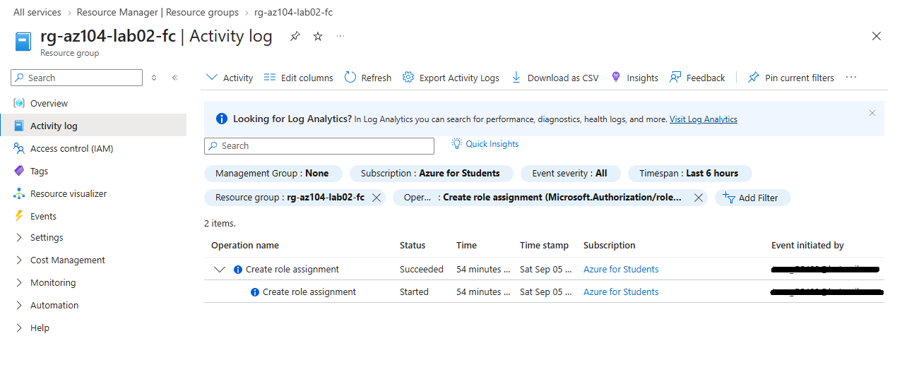

# 🔎 Runbook de Auditoría y Trazabilidad: Azure Activity Log

**Objetivo:** Establecer el procedimiento para la monitorización y trazabilidad de cambios en el control de acceso (RBAC), garantizando el no repudio y facilitando la respuesta ante incidentes (IR) frente a posibles elevaciones de privilegios.

## 1. Monitorización de Cambios en IAM
El Registro de Actividad de Azure (Activity Log) actúa como el plano de control central para la auditoría forense. Registra todos los eventos de escritura, modificación y eliminación (PUT, POST, DELETE) a nivel de suscripción.

* **Ruta de acceso:** `Todos los servicios > Registro de actividad (Activity Log)`
* **Filtros Críticos de Seguridad (KQL / UI):**
  * `Operation`: *Create role assignment* (Detectar nuevos accesos concedidos).
  * `Operation`: *Delete role assignment* (Detectar revocaciones de acceso).
  * `Operation`: *Create or update custom role definition* (Detectar creación de roles personalizados que podrían esquivar los controles integrados).

## 2. Análisis Forense del Evento
Al auditar un evento de "Crear asignación de rol", el equipo de seguridad debe validar tres vectores en el payload del registro:
1. **Actor (Quién):** Identidad que ejecutó la acción.
2. **Target (A quién):** La entidad de seguridad que recibió el privilegio.
3. **Scope (Dónde):** El nivel de recursos afectado.

>  

---
*Documento generado como parte de los procedimientos de seguridad y gobierno de infraestructura Cloud.*