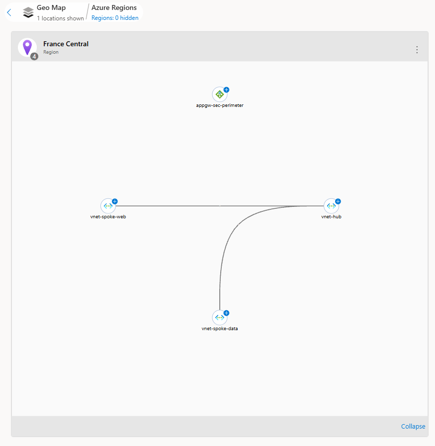

### 🛡️ Custom Challenge: Arquitectura Zero Trust (Hub-and-Spoke y WAF)
**Objetivo:** Diseñar e implementar una topología de red corporativa segura en Azure aplicando los principios de *Zero Trust* (Confianza Cero), evitando la transitividad directa entre capas y forzando la inspección del tráfico mediante *Service Chaining*.

#### 1. Segmentación de Redes y Topología
Se han desplegado tres redes virtuales aisladas en la región `France Central` para delimitar físicamente el perímetro de cada capa de la aplicación:
*   **vnet-hub (10.0.0.0/16):** Contiene las subredes de enrutamiento y seguridad (`AzureFirewallSubnet`, `GatewaySubnet`, `snet-appgw`).
*   **vnet-spoke-web (10.1.0.0/16):** Aísla la capa de presentación (`snet-web`).
*   **vnet-spoke-data (10.2.0.0/16):** Aísla la capa de bases de datos (`snet-data`).

#### 2. Conectividad Controlada (VNet Peering Restrictivo)
Para aislar los entornos y romper la transitividad por defecto, se han configurado conexiones en estrella:
*   **hub-to-web / web-to-hub:** Conexión bidireccional permitida.
*   **hub-to-data / data-to-hub:** Conexión bidireccional permitida.
*   *Nota de seguridad:* No se ha establecido ningún emparejamiento directo entre la red Web y la red Data, previniendo el movimiento lateral.

#### 3. Secuestro del Tráfico y Service Chaining (UDR)
Se implementó una **Tabla de Rutas (Route Table)** para forzar la inspección del tráfico interno (Este-Oeste).
*   **Ruta Definida por el Usuario (UDR):** Se creó la ruta `Force-To-Firewall` para interceptar el tráfico con destino a la base de datos (`10.2.0.0/16`).
*   **Next Hop (Próximo salto):** Configurado como `Virtual appliance` apuntando a la IP `10.0.1.4` (simulando un NVA en el Hub).
*   **Asociación:** La tabla de rutas se vinculó a la subred `snet-web`.

#### 4. Perímetro de Aplicación (Application Gateway WAF v2)
Para proteger el tráfico externo (Norte-Sur), se desplegó un proxy inverso de Capa 7.
*   **Configuración:** Desplegado en la subred dedicada `snet-appgw` con una IP Pública (`pip-appgw`).
*   **Seguridad:** Directiva WAF `waf-policy-sec` en modo Detección para inspeccionar vulnerabilidades web (HTTP/80) antes de reenviar el tráfico al pool de servidores web (`10.1.0.4`).

#### 5. Auditoría y Trazabilidad (Network Watcher)
Para verificar visualmente la segmentación y asegurar que el tráfico fluye según el diseño Hub-and-Spoke no transitivo, se extrajo la topología lógica de la infraestructura. Como demuestra la siguiente evidencia, las redes periféricas están completamente aisladas entre sí y centralizadas a través del Hub.

#### 6. Guía de Reproducción (Manual de Despliegue)
Para replicar este entorno desde cero, se deben seguir los siguientes pasos operativos:

1.  **Despliegue Base:** Crear el grupo de recursos `rg-sec-portfolio` en `France Central`.
2.  **Redes Virtuales:**
    *   Crear `vnet-hub` (10.0.0.0/16) con las subredes `AzureFirewallSubnet` (10.0.1.0/26), `GatewaySubnet` (10.0.2.0/27) y `snet-appgw` (10.0.3.0/24).
    *   Crear `vnet-spoke-web` (10.1.0.0/16) con la subred `snet-web` (10.1.0.0/24).
    *   Crear `vnet-spoke-data` (10.2.0.0/16) con la subred `snet-data` (10.2.0.0/24).
3.  **VNet Peering:** En `vnet-hub`, agregar dos emparejamientos independientes. Uno apuntando a `vnet-spoke-web` y otro a `vnet-spoke-data`, permitiendo el tráfico reenviado en ambos enlaces.
4.  **UDR:** Crear la Route Table `rt-web-to-data`. Añadir la ruta `Force-To-Firewall` (Destino: 10.2.0.0/16, Próximo salto: Virtual Appliance en 10.0.1.4). Asociar la tabla a la subred `snet-web`.
5.  **Application Gateway:** Crear un recurso SKU WAF V2 en la red `vnet-hub` (subred `snet-appgw`). Generar una nueva directiva WAF, asignar una nueva IP pública, apuntar el backend pool a la IP ficticia `10.1.0.4` y configurar una regla de enrutamiento HTTP en el puerto 80.
6.  **Auditoría:** Habilitar Network Watcher en `France Central`, acceder a la herramienta Topología, filtrar por la `vnet-hub` y navegar por el Geo Map hasta el nivel de recursos para extraer la evidencia visual.

--------------------------------------------------------------------------------

*Laboratorio completado y recursos eliminados (FinOps). La arquitectura base cuenta ahora con segmentación estricta y protección de Capa 7.*