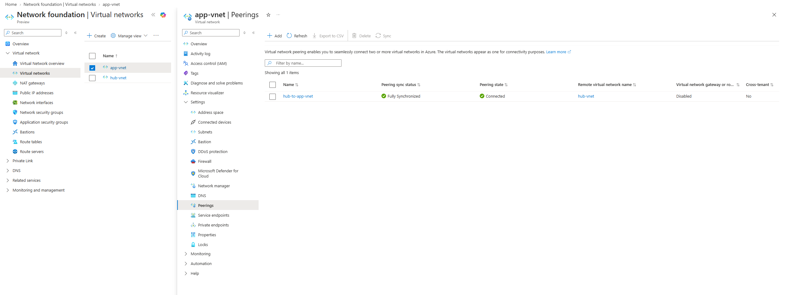

# 🌐 Ejercicio 01: Creación y Configuración de Redes Virtuales (Hub & Spoke)

**Objetivo:** Implementar una arquitectura de red Hub-and-Spoke para aislar de forma segura una aplicación web migrada a Azure. Este diseño segmenta el tráfico de la aplicación y prepara un concentrador para centralizar la seguridad perimetral.

## 1. Despliegue de la Red Virtual de Aplicación (app-vnet)
Esta red (Spoke) contiene la segmentación necesaria para separar la capa de presentación de la capa de datos.

*   **Resource group:** `RG1`
*   **Region:** `East US`
*   **Virtual network name:** `app-vnet`
*   **IPv4 address space:** `10.1.0.0/16`
*   **Subnet 1 (Web Servers):** `frontend` | Rango: `10.1.0.0/24`
*   **Subnet 2 (Database):** `backend` | Rango: `10.1.1.0/24`

## 2. Despliegue de la Red Virtual Concentradora (hub-vnet)
El Hub actúa como el punto central de conectividad. Se incluye una subred con el tamaño y nomenclatura exactos requeridos para el futuro despliegue de un firewall nativo.

*   **Resource group:** `RG1`
*   **Region:** `East US`
*   **Virtual network name:** `hub-vnet`
*   **IPv4 address space:** `10.0.0.0/16`
*   **Subnet 1 (Firewall):** `AzureFirewallSubnet` | Rango: `10.0.0.0/26`

## 3. Configuración del Emparejamiento (VNet Peering)
Para permitir la comunicación privada y segura entre las máquinas virtuales y el concentrador a través del *backbone* de Azure, se ha establecido una conexión de emparejamiento bidireccional.

*   **Remote peering link name:** `app-vnet-to-hub`
*   **Local virtual network peering link name:** `hub-to-app-vnet`
*   **Estado final:** `Connected`

>  