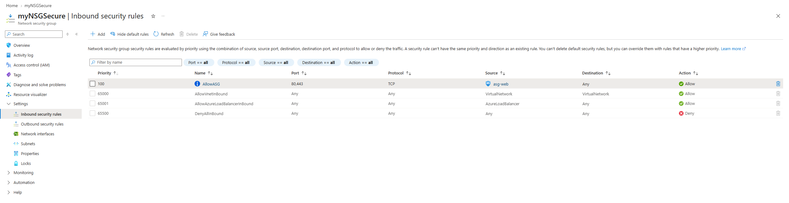
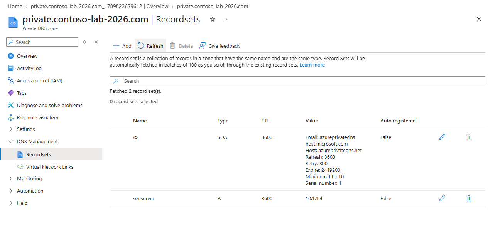

# 🛡️ Ejercicio 02: Implementación de Seguridad de Red (NSG/ASG) y DNS

**Objetivo:** Desplegar una arquitectura de red escalable utilizando Infraestructura como Código (IaC), aplicar controles de microsegmentación "Zero Trust" mediante NSG y ASG, y configurar la resolución de nombres DNS pública y privada.

## 1. Despliegue de Redes (Portal e IaC)
Se ha configurado la infraestructura base anticipando un gran crecimiento de recursos, evitando el solapamiento de direcciones IP (IP overlapping):
*   **CoreServicesVnet:** Desplegada vía Portal de Azure (`10.20.0.0/16`) con segmentación para servicios compartidos y bases de datos.
*   **ManufacturingVnet:** Desplegada mediante plantillas ARM (Infraestructura como Código) modificando los parámetros JSON (`10.30.0.0/16`) para escalar las operaciones rápidamente.

## 2. Microsegmentación: ASG y NSG
Para abandonar la seguridad basada únicamente en IPs, se ha implementado un enfoque centrado en la aplicación:
*   **Application Security Group (asg-web):** Agrupación lógica de los futuros servidores web.
*   **Network Security Group (myNSGSecure):** Asociado a la subred `SharedServicesSubnet`.
    *   ✅ **Regla de Entrada (Prioridad 100):** Permite tráfico HTTP (80) y HTTPS (443) cuyo origen sea específicamente el grupo `asg-web`.
    *   ❌ **Regla de Salida (Prioridad 4096):** Bloquea explícitamente el tráfico hacia Internet (Etiqueta de servicio: Internet) para evitar la exfiltración de datos.

>  

## 3. Resolución de Nombres (Azure DNS)
Implementación de resolución de nombres segura y unificada:
*   **Zona DNS Pública:** Configurada para resolver nombres de dominio hacia Internet (ej. www).
*   **Zona DNS Privada:** Vinculada directamente a la VNet (`manufacturing-link`) para aislar la resolución de nombres internos (ej. sensorvm), impidiendo el acceso desde el exterior.

>  