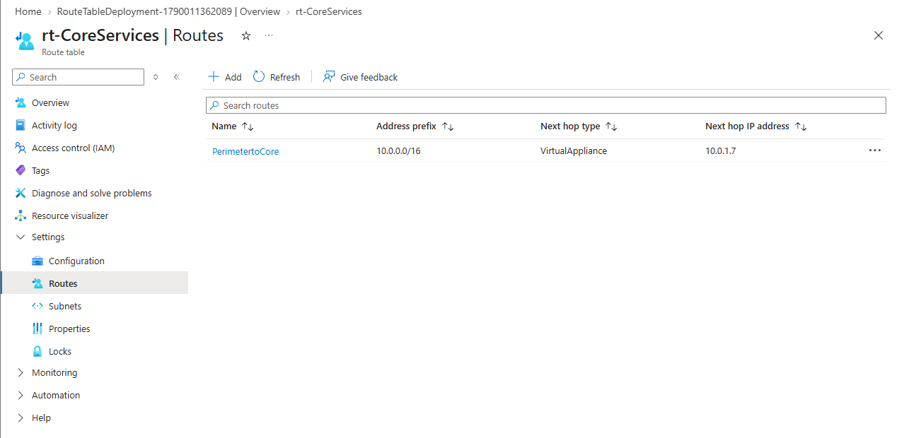

# 🌐 Ejercicio 04: Conectividad entre sitios y Enrutamiento Personalizado (UDR)

**Objetivo:** Implementar topologías de red interconectadas y forzar el tráfico a través de dispositivos de seguridad (Network Virtual Appliances) utilizando Tablas de Rutas.

## 1. Topología y VNet Peering (Concepto implementado)
Para conectar entornos aislados (ej. Core vs Manufactura) sin exponer el tráfico a Internet, se diseña una arquitectura de **VNet Peering**. 
*   **Intransitividad:** Se comprende que el peering no es transitivo por defecto.
*   **Tránsito de Puerta de Enlace:** Se habilita el *Gateway Transit* en arquitecturas Hub-and-Spoke para que las redes remotas puedan compartir una conexión VPN centralizada, optimizando costes de infraestructura.

## 2. Enrutamiento Personalizado y Service Chaining (UDR)
Por defecto, Azure enruta el tráfico entre subredes directamente. Para cumplir con las normativas de seguridad (Zero Trust), se implementó una **Tabla de Rutas (Route Table)** para forzar la inspección del tráfico.

*   **Ruta Definida por el Usuario (UDR):** Se creó la ruta `PerimetertoCore` para interceptar el tráfico con destino `10.0.0.0/16`.
*   **Next Hop (Próximo salto):** Se configuró como `Virtual appliance` apuntando a la IP `10.0.1.7` (simulando un Firewall de próxima generación).
*   **Asociación:** La tabla de rutas se vinculó a la subred `perimeter`, garantizando que todo el tráfico saliente de esa zona sea inspeccionado antes de llegar a los servicios críticos.

>  