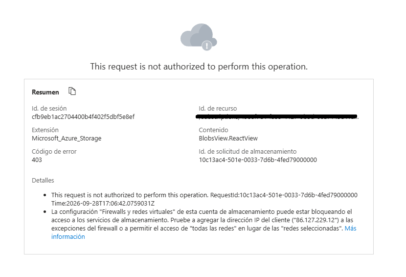
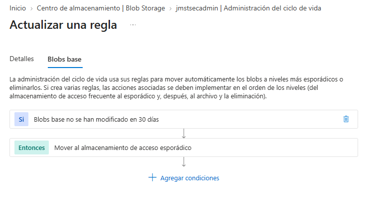

### 🛡️ Lab 07: Arquitectura de Almacenamiento Seguro (Zero Trust & FinOps)

**Objetivo:** Implementar una cuenta de almacenamiento securizada por defecto, aplicando microsegmentación de red, políticas de inmutabilidad legal para los datos y automatización del ciclo de vida para la optimización continua de costes.

#### 1. Aislamiento Perimetral y Zero Trust (VNet Integration)
Para proteger el plano de datos frente a exfiltraciones o accesos no autorizados desde Internet, se ha diseñado un perímetro de red estricto:
*   **Default Deny:** El acceso público a la cuenta de almacenamiento se deshabilitó desde el momento del aprovisionamiento.
*   **Service Endpoints:** Se integró la cuenta exclusivamente con una red virtual dedicada (`vnet1`). Solo los recursos internos de esta subred tienen línea de visión con el almacenamiento.
*   **Bloqueo Administrativo:** Esta configuración Zero Trust garantiza que incluso los administradores globales sean rechazados (Error 403) si intentan acceder a los blobs o archivos desde fuera de la red virtual autorizada.

#### 2. Protección de Datos y Cumplimiento Legal (WORM)
Se ha blindado la integridad de la información crítica alojada en el contenedor frente a modificaciones accidentales o ataques de ransomware.
*   **Políticas de Inmutabilidad:** Se aplicó una directiva de retención basada en tiempo (Time-based retention) a nivel de contenedor.
*   **Cumplimiento WORM (Write Once, Read Many):** Los archivos depositados quedan bloqueados y no pueden ser sobrescritos ni eliminados bajo ninguna circunstancia durante un período garantizado de 180 días.

#### 3. Delegación de Acceso Seguro (Shared Access Signatures)
El acceso de clientes externos a recursos específicos se gestiona sin comprometer las claves de acceso maestras de la cuenta.
*   **Tokens SAS:** Se implementaron Firmas de Acceso Compartido con privilegios mínimos (exclusivamente permisos de lectura) y una ventana de caducidad estricta para delegar el consumo temporal de activos aislados.

#### 4. Optimización de Costes (FinOps)
Se aplicó la automatización nativa de Azure para alinear el consumo de almacenamiento con las mejores prácticas financieras.
*   **Lifecycle Management:** Se configuró la regla `Movetocool`, la cual evalúa diariamente el estado de los blobs. Si un archivo base no ha sido modificado en más de 30 días, el motor de Azure lo transfiere automáticamente del nivel de acceso Frecuente (Hot) al nivel Esporádico (Cool), reduciendo drásticamente el gasto operativo por almacenamiento inactivo.

#### 5. Evidencias de Auditoría

*   **Evidencia 1: Validación Zero Trust**
    
    *Descripción: Intercepción de acceso al plano de datos (Error 403) demostrando la eficacia del cortafuegos de almacenamiento al rechazar conexiones externas a la VNet.*

*   **Evidencia 2: Automatización FinOps**
    
    *Descripción: Directiva de ciclo de vida activa para la reducción automatizada de costes en datos fríos.*