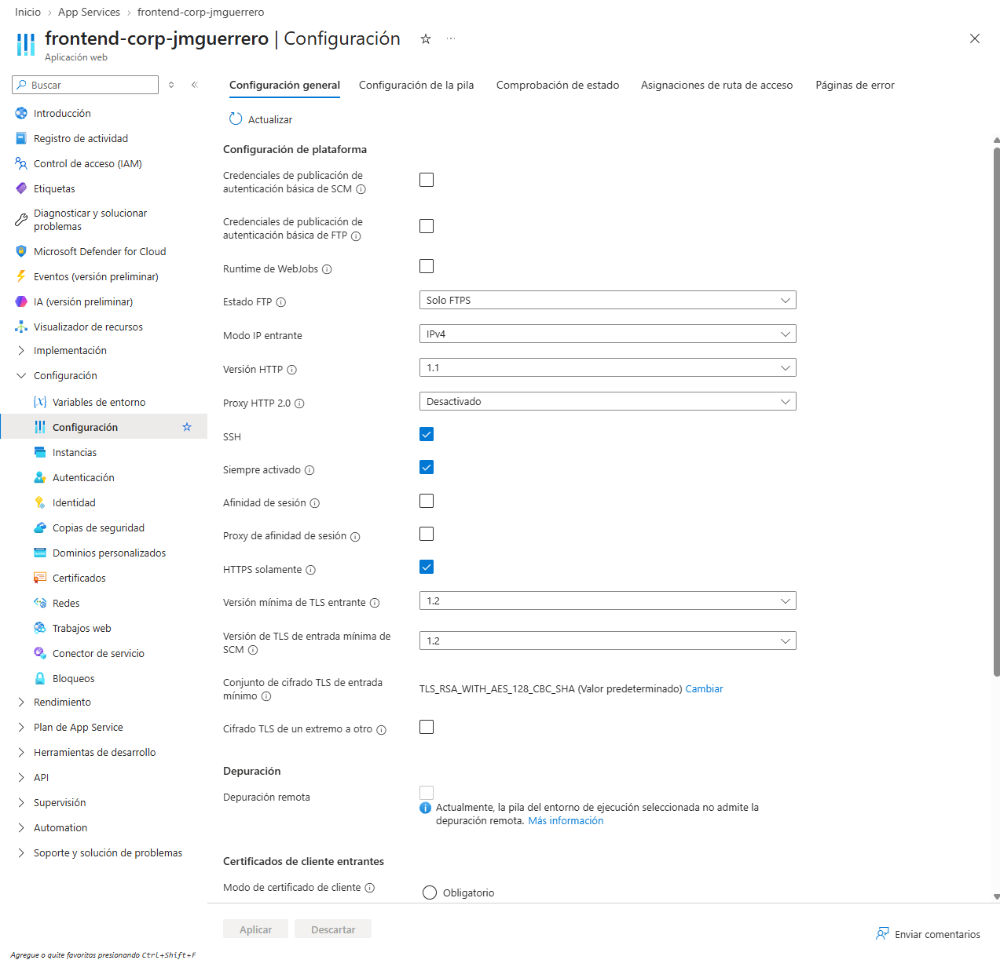
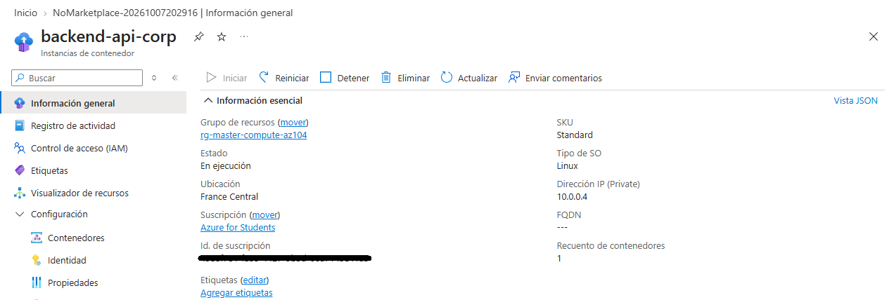
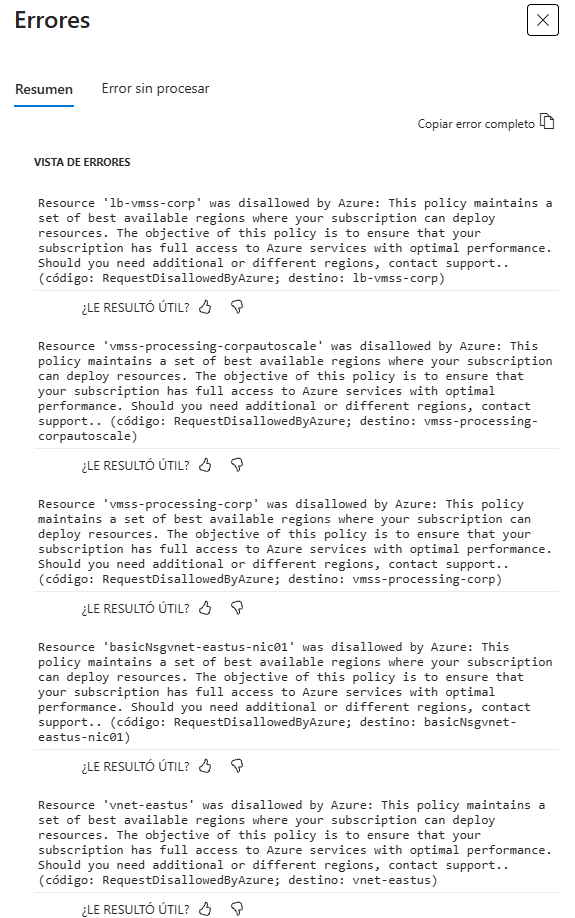

### 🛡️ Custom Challenge: Arquitectura Híbrida Segura y Escalable (PaaS, CaaS & IaaS)
**Objetivo:** Diseñar e implementar una arquitectura de tres capas integrando servicios gestionados y de infraestructura, aplicando controles Zero Trust en la red perimetral y automatizando la optimización de costes (FinOps) mediante el autoescalado.

#### 1. Frontend Seguro y Resiliente (PaaS)
Para aislar la capa de presentación y asegurar las comunicaciones desde el usuario final, se desplegó un servicio web bastionado (`frontend-corp-jmguerrero`):
-   **Seguridad Perimetral (TLS/HTTPS):** Se activó la directiva `HTTPS solamente` forzando la `Versión mínima de TLS entrante` a 1.2 para rechazar cualquier petición en texto plano, mitigando los riesgos de interceptación.
-   **Disponibilidad Continua:** Se habilitó la opción `Siempre activado` para evitar la suspensión del proceso trabajador por inactividad.

#### 2. Segmentación y Seguridad Zero Trust (CaaS & Red)
La lógica de negocio principal (`backend-api-corp`) se protegió erradicando su exposición a la red pública, implementando un microservicio en un entorno de red aislado:
-   **Inyección en VNet:** Se aprovisionó una instancia de contenedor delegando su interfaz de red directamente a una subred corporativa en la región `France Central`.
-   **Aislamiento Estricto:** Se le asignó exclusivamente una dirección IP privada (`10.0.0.4`), asegurando que el FQDN público quedara deshabilitado (`---`). El servicio es completamente invisible desde Internet y solo accesible mediante enrutamiento interno.

#### 3. Procesamiento IaaS Elástico (FinOps & HA)
Para la capa de procesamiento en segundo plano, se diseñó un clúster IaaS optimizado financieramente:
-   **Autoescalado Paramétrico:** Se configuraron políticas de escalado dinámico en un Virtual Machine Scale Set (VMSS) basadas en CPU (Scale-Out al 75%, Scale-In al 30%) para adaptar el consumo de instancias al uso real.
-   **Troubleshooting (Limitación de Cuota):** Durante el despliegue final se documentó un bloqueo de políticas (`disallowed by Azure`) por restricción de cuota de vCPU en la suscripción "Azure for Students". La resolución en entornos de producción requeriría la apertura de un ticket de soporte técnico (Request Quota Increase).

--------------------------------------------------------------------------------

*Laboratorio completado. La arquitectura base cuenta ahora con cifrado forzado en el frontend, segmentación de red estricta en el backend y diseño elástico preparado para optimización de costes.*